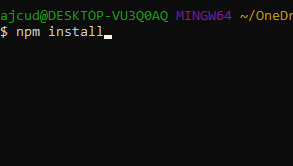
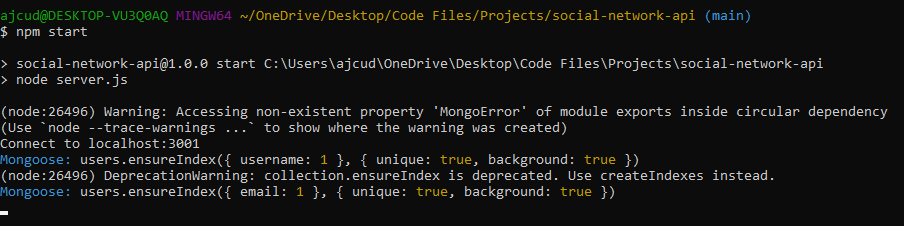
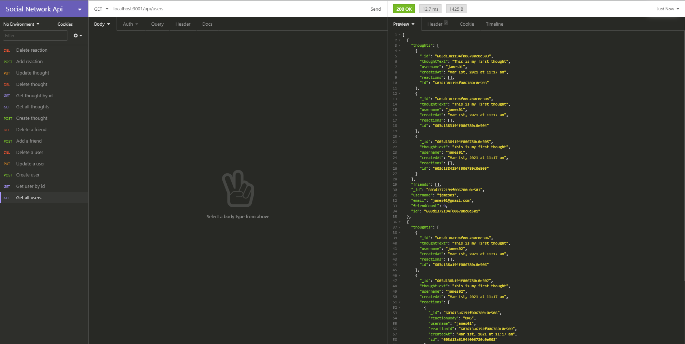

# Social Network Api

## Description

This is a Social Network API built using Mongoose and is ready to be hooked up to a front end

## Table of Contents

- [Installation](#installation)
- [Usage](#usage)
- [Instructions](#instructions)
- [Questions](#questions)

## Installation

In order to install this project you must clone this project on to your local machine.

## Usage

This project usage is for anyone that needs a back-end for their social network type site

## Instructions

- If you would like to view a video on how to install and use, go to my [Youtube Channel](https://youtu.be/Uz7rW3B_2tg)

- Step 1: Clone this repository

* 

- Step 2: Install dependencies with 'npm install'

* 

- Step 3: Type 'npm start' once more to start the server

* 

- Step 4: Open Insomnia core/postman

* 

* Step 10: You can create, read, update, and delete users and thoughts, and add and delete reactions and friends using these urls:
  - http://localhost:3001/api/user
  - http://localhost:3001/api/user/:id (required to delete, update, or just to read one category)
    - To post a user - JSON being sent will be this: { "username": "`username`", "email": "`email@example.com`" }
  - http://localhost:3001/api/user/:userId/friends/:friendsId (required to delete and add a friend)
  - http://localhost:3001/api/thoughts
    - To create a thought - JSON being send will be formated like this: { "thoughtText": "`This is an example thought`", "username": "`username of person creating the thought`" }
  - http://localhost:3001/api/thoughts/:id (required to delete, update, or just to read one tag)
  - http://localhost:3001/api/thougts/:thoughtsId/reactions (required to add a reaction to a thought)
    - To create a reaction - JSON being send will be formated like this: { "reactionBody": "`This is an example reaction`", "username": "`username of person creating the reaction`" }
  - http://localhost:3001/api/thoughts/:thoughtsId/reactions/:reactionsId (required to delete a reaction from a thought)

## Questions

Created by: [ajcuddeback](https://github.com/ajcuddeback)

If you have any further questions please feel free to contact me at [ajcuddeback@gmail.com](ajcuddeback@gmail.com)
